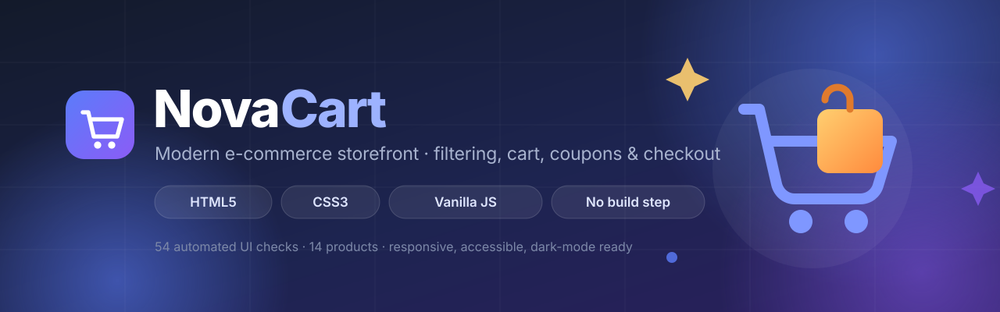

<div align="center">



# NovaCart — E-Commerce Store

A complete, responsive online store built with **vanilla HTML, CSS and JavaScript**.
No frameworks, no build step, no dependencies — clone it and open the page.

[](#)
[](#)
[](#)
[](#testing)
[](#project-structure)
[](LICENSE)

</div>

---

## Overview

NovaCart is a front-end e-commerce storefront: a shopper can browse a catalogue of
14 products, search and filter it, save items to a wishlist, manage a cart that
survives a page reload, apply discount coupons and complete a full checkout flow.

Everything runs in the browser. State is persisted with `localStorage`, the
catalogue is a plain data file, and every product image is a locally generated SVG —
so the store works completely offline with no CDN, no API and no server-side code.

<div align="center">

| | | | | |
|:--:|:--:|:--:|:--:|:--:|
|  |  |  |  |  |

<sub>All 14 product illustrations are hand-authored SVG files stored in the repository.</sub>

</div>

---

## Running it locally

**Option 1 — just open it**

```bash
git clone https://github.com/nikhileshwar-12/CodeAlpha_EcommerceStore.git
cd CodeAlpha_EcommerceStore
open index.html          # macOS  (or: start index.html on Windows, xdg-open on Linux)
```

**Option 2 — with a local server** (recommended, matches production behaviour)

```bash
npm start                # serves on http://localhost:8080
```

The dev server (`tools/serve.js`) has **zero dependencies** — it only uses Node's
built-in `http` module. `npm install` is required solely to run the test suite.

---

## Features

### Catalogue & discovery
- **14 products** across 6 categories, each with pricing, sale pricing, ratings, review counts and live stock levels
- **Live keyword search** across product name, category and description
- **Category chips** with proper `aria-pressed` state
- **Price ceiling slider** and **5 sort modes** (featured, price ↑, price ↓, top rated, A–Z)
- **Empty state** and a live result count announced to screen readers
- **One-click filter reset**

### Shopping
- **Wishlist** with a header badge, a dedicated filter view and persistence
- **Slide-out cart drawer** with quantity steppers, per-line totals and item removal
- **Quick-view modal** for each product with a full spec list
- **Coupon engine** — `NOVA10`, `SAVE20`, `FREESHIP`
- **Free-shipping progress hint** ("Add $68.00 more to unlock free shipping")
- **Order maths** — subtotal, discount, shipping, 8% estimated tax and grand total

### Checkout
- Validated address form (name, email, address, city, postcode, optional demo card)
- Per-field inline error states with `aria-invalid` and automatic focus management
- Order summary itemised inside the checkout modal
- Generated order reference (e.g. `NC-WTHEMG-947`) and an estimated delivery date
- Cart and coupon cleared on successful order

### Experience
- **Dark and light themes** with system-preference detection and persistence
- **Toast notifications** for every meaningful action
- **Responsive** from 320 px phones to ultrawide desktops
- **Accessible**: skip link, focus trapping in overlays, Escape-to-close, focus restoration, ARIA dialogs and live regions
- **Reduced-motion** support and a print stylesheet

---

## Coupons

| Code | Effect |
|------|--------|
| `NOVA10` | 10% off the subtotal |
| `SAVE20` | 20% off the subtotal |
| `FREESHIP` | Free shipping regardless of order value |

Shipping is $9.99 flat, and free automatically once the subtotal passes **$100**.

---

## Project structure

```
CodeAlpha_EcommerceStore/
├── index.html                 # Single-page storefront markup
├── assets/
│   ├── css/
│   │   └── styles.css         # Design tokens, components, themes, responsive rules
│   ├── js/
│   │   ├── products.js        # Catalogue data + coupons + store config
│   │   └── app.js             # Application logic (filters, cart, checkout, theme)
│   └── img/
│       ├── banner.svg         # README banner
│       ├── hero.svg           # Hero illustration
│       ├── logo.svg           # Brand mark / favicon
│       └── *.svg              # 14 product illustrations
├── tools/
│   └── serve.js               # Zero-dependency static dev server
├── tests/
│   └── store.test.js          # 54 end-to-end UI checks (jsdom)
├── package.json
├── LICENSE
└── README.md
```

---

## Testing

The project ships with an end-to-end suite that boots the real `index.html` in
[jsdom](https://github.com/jsdom/jsdom) and drives the interface the way a shopper
would — clicking filters, adding to cart, applying coupons and submitting checkout.

```bash
npm install
npm test
```

```
NovaCart storefront tests
  Catalogue
    PASS  renders every product as a card  → 14 cards
    PASS  renders a chip per category plus wishlist
    PASS  announces the result count
  Filtering, search & sort
    PASS  category filter narrows the grid  → 2 cards
    PASS  active chip exposes aria-pressed
    PASS  chips keep their DOM node (focus is preserved)
    ...
  Checkout
    PASS  blank form is blocked
    PASS  malformed email is caught
    PASS  order id is generated  → Order NC-WTHEMG-947
    PASS  cart is emptied after ordering

54/54 checks passed
```

Covered areas: catalogue rendering · filtering, search and sorting · wishlist ·
cart operations and totals · coupon validation and discount maths · free-shipping
threshold · quick view · checkout validation · order placement · theme
persistence · accessibility affordances · Escape-key handling.

---

## Under the hood

| Concern | Approach |
|---|---|
| State | A single `state` object (`cart`, `wishlist`, `coupon`, `filters`) |
| Persistence | `localStorage` under versioned keys — `novacart.cart.v1`, `novacart.wishlist.v1`, `novacart.coupon.v1`, `novacart.theme.v1` |
| Rendering | Template-string rendering with escaped interpolation, delegated event listeners on container elements |
| Money | `Intl.NumberFormat` currency formatting, no floating-point display bugs |
| Theming | CSS custom properties swapped by a `data-theme` attribute on `<html>` |
| Overlays | Shared overlay element, focus trap, Escape-to-close, focus restoration |
| Dependencies | **None at runtime.** `jsdom` is a dev dependency for tests only |

### Browser support

Chrome/Edge 111+, Firefox 113+, Safari 16.4+ — the floor is set by
`color-mix()` in the header and overlay styling. Everything else degrades
gracefully in older engines.

---

## Notes

- Checkout is a **demonstration only**: no payment gateway is called, no network
  request is made, and no personal data leaves the browser.
- Product artwork is original SVG written for this project rather than
  stock photography, which keeps the repository small, fast and licence-clean.
- Built as a CodeAlpha Web Development internship task submission.

## License

[MIT](LICENSE) © Nikhil Reddy Dappili
